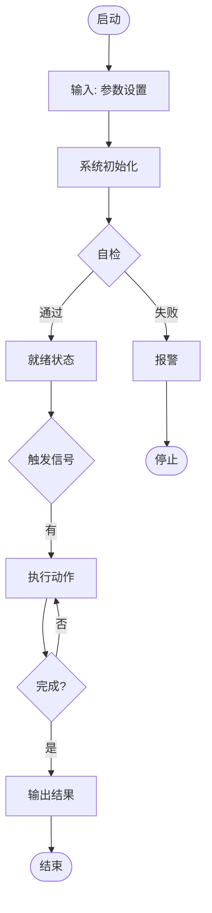
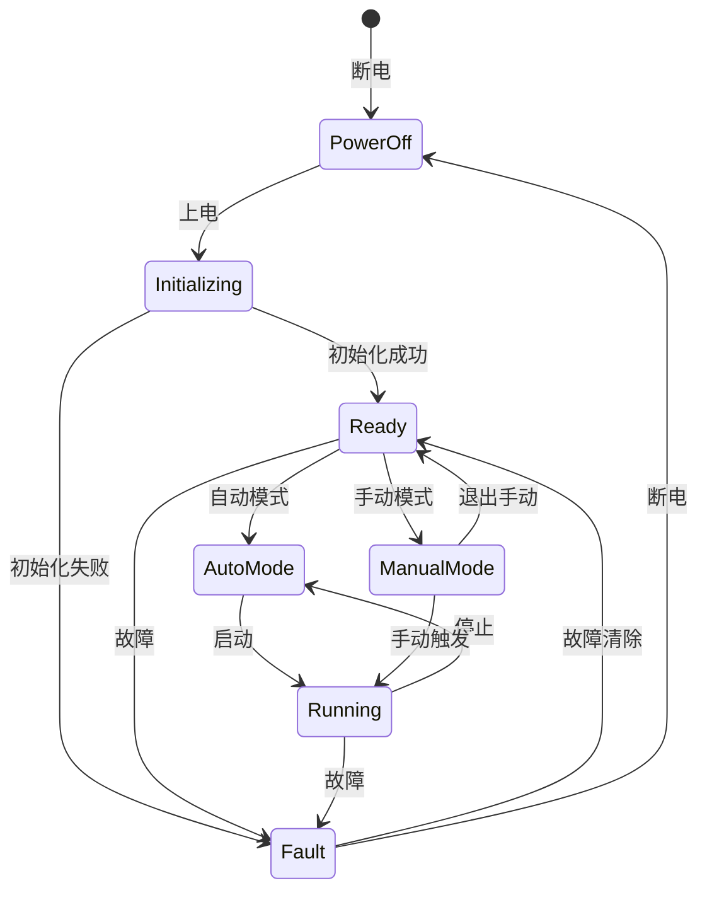
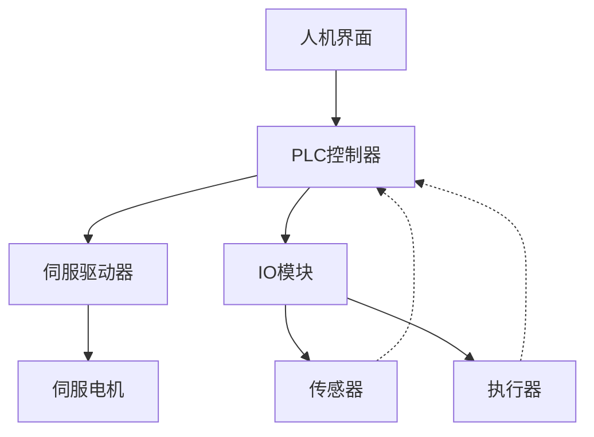

# 机械设计文档模板

**项目名称**: [项目名称]
**文档版本**: V1.0
**编制日期**: [日期]
**编制人**: [姓名]
**审核人**: [姓名]

---

## 1. 项目概述

### 1.1 项目背景
- **设计对象**: [设备/机构/系统名称]
- **应用领域**: [工业/消费/医疗/汽车/航空航天等]
- **设计类型**: □ 纯机械  □ 机电一体化  □ 自动化系统  □ 综合项目

### 1.2 设计目标
- **功能需求**: [描述设备需要实现的核心功能]
- **性能指标**: [关键性能参数]
- **约束条件**: [成本/空间/时间/标准等约束]

---

## 2. 需求分析

### 2.1 功能需求
| 功能编号 | 功能描述 | 工作模式 | 优先级 |
|---------|---------|---------|-------|
| F-01 | [功能1] | 自动/手动 | 高 |
| F-02 | [功能2] | 自动/手动 | 中 |
| F-03 | [功能3] | 自动/手动 | 低 |

### 2.2 性能指标
| 指标类别 | 指标名称 | 目标值 | 测量方法 |
|---------|---------|-------|---------|
| **运动参数** | 最大速度 | [数值] [单位] | [方法] |
| | 加速度 | [数值] [单位] | [方法] |
| | 行程 | [数值] [单位] | [方法] |
| | 定位精度 | [数值] [单位] | [方法] |
| | 重复定位精度 | [数值] [单位] | [方法] |
| **力/力矩** | 最大负载 | [数值] [单位] | [方法] |
| | 额定推力/扭矩 | [数值] [单位] | [方法] |
| | 安全系数 | [数值] | - |
| **寿命** | 工作寿命 | [数值] [小时/年] | - |
| | 循环次数 | [数值] [次] | - |
| | MTBF | [数值] [小时] | - |
| **环境** | 工作温度 | [范围]°C | 温度计 |
| | 环境湿度 | [范围]% | 湿度计 |
| | 防护等级 | IP[等级] | - |
| | 洁净度要求 | [等级] | - |

### 2.3 约束条件
| 约束类型 | 具体要求 | 备注 |
|---------|---------|-----|
| **空间限制** | 外形尺寸: [长×宽×高] | [安装空间描述] |
| | 安装方式: [落地/壁挂/吊装] | [安装孔位] |
| **成本限制** | 目标成本: [数值]元 | [成本敏感度] |
| **时间限制** | 交付周期: [数值]周 | [关键里程碑] |
| **标准规范** | GB/T [标准号] | [具体要求] |
| | ISO [标准号] | [具体要求] |
| | CE认证/3C认证 | [具体要求] |

### 2.4 接口需求
#### 2.4.1 机械接口
- **安装接口**: [描述安装孔位、连接方式]
- **运动接口**: [与其他机构的连接方式]
- **人机接口**: [操作手柄、按钮、把手等]

#### 2.4.2 电气接口
- **电源**: [电压/频率/功率]
- **信号**: [I/O点数、信号类型]
- **通信**: [通信协议、接口类型]
- **接地**: [接地方式、接地电阻]

#### 2.4.3 控制接口
- **控制方式**: [手动/半自动/全自动]
- **人机界面**: [按钮/指示灯/HMI/PC]
- **数据采集**: [传感器类型、采集频率]

---

## 3. 方案设计

### 3.1 功能分解
```
总功能: [描述]
├── 子功能1: [描述]
│   ├── 技术原理A: [描述]
│   ├── 技术原理B: [描述]
│   └── 技术原理C: [描述]
├── 子功能2: [描述]
│   └── 技术原理D: [描述]
└── 子功能3: [描述]
    └── 技术原理E: [描述]
```

### 3.2 原理方案
#### 方案A: [方案名称]
- **总体描述**: [方案整体描述]
- **技术路线**:
  - [子功能1]: 采用[技术原理]
  - [子功能2]: 采用[技术原理]
  - [子功能3]: 采用[技术原理]
- **结构示意**:
```
    ASCII线框图示例:
    ┌─────────────────────────────────┐
    │                                 │
    │   [组件1] ── [传动] ── [组件2]   │
    │      │                      │    │
    │   [驱动]                [负载]   │
    │                                 │
    └─────────────────────────────────┘
```

#### 方案B: [方案名称]
- **总体描述**: [方案整体描述]
- **技术路线**: [同上格式]

#### 方案C: [方案名称]
- **总体描述**: [方案整体描述]
- **技术路线**: [同上格式]

### 3.3 方案对比
| 评价维度 | 权重 | 方案A | 方案B | 方案C | 说明 |
|---------|------|-------|-------|-------|------|
| **成本** | 30% | 低(9分) | 中(7分) | 高(5分) | [分析] |
| **精度** | 25% | 中(7分) | 高(9分) | 高(9分) | [分析] |
| **可靠性** | 20% | 高(9分) | 中(7分) | 高(9分) | [分析] |
| **维护性** | 15% | 中(7分) | 低(5分) | 中(7分) | [分析] |
| **扩展性** | 10% | 低(5分) | 高(9分) | 中(7分) | [分析] |
| **加权总分** | 100% | **7.8** | **7.2** | **7.1** | |

**推荐方案**: 方案[A/B/C]
**推荐理由**: [基于权重和具体需求的分析]

---

## 4. 系统原理

### 4.1 工作原理
[详细描述系统的工作原理和流程]

### 4.2 系统流程图


### 4.3 控制逻辑（机电一体化项目）


---

## 5. 详细设计

### 5.1 机械系统设计

#### 5.1.1 传动系统
**电机选型计算**:
- 负载惯量: \(J_L = [公式] = [数值] kg·m²\)
- 所需扭矩: \(T = [公式] = [数值] N·m\)
- 所需功率: \(P = [公式] = [数值] kW\)
- 安全系数: \(K = [数值]\)

**选型结果**:
| 参数 | 要求值 | 选型值 | 安全系数 |
|------|-------|-------|---------|
| 电机型号 | - | [型号] | - |
| 额定功率 | [数值]kW | [数值]kW | [比值] |
| 额定扭矩 | [数值]N·m | [数值]N·m | [比值] |
| 额定转速 | [数值]rpm | [数值]rpm | - |
| 品牌 | - | [品牌] | - |

**减速器选型**:
- 减速比: \(i = [数值]\)
- 输出扭矩: \(T_{out} = [数值] N·m\)
- 惯量匹配: \(\frac{J_L}{J_M} = [数值] ≤ [推荐值]\)

**传动机构**: [滚珠丝杠/同步带/齿轮]
- 型号规格: [详细规格]
- 精度等级: [C1/C3/C5或具体等级]
- 导程/模数: [数值]
- 行程/传动比: [数值]

#### 5.1.2 结构强度计算
**关键零件1**: [名称]
- 材料: [牌号]
- 受力分析: [简述]
- 强度校核: \(\sigma = [公式] = [数值] MPa ≤ [\sigma] = [数值] MPa\)
- 结论: ✓ 满足要求 / ✗ 不满足（需调整）

**关键零件2**: [名称]
- [同上格式]

#### 5.1.3 轴承选型
| 轴承位 | 轴承型号 | 内径 | 外径 | 宽度 | 额定动载荷C | 当量动载荷P | 额定寿命L10 |
|-------|---------|-----|-----|-----|-----------|-----------|-----------|
| 轴承座1 | [型号] | [d] | [D] | [B] | [C] | [P] | [L10]小时 |
| 轴承座2 | [型号] | [d] | [D] | [B] | [C] | [P] | [L10]小时 |

#### 5.1.4 机架/结构设计
- **材料**: [牌号]，性能: [屈服强度/抗拉强度]
- **结构形式**: [型钢/焊接/铸造]
- **截面规格**: [详细规格]
- **表面处理**: [喷塑/镀锌/阳极氧化]

### 5.2 电气系统设计（机电一体化项目）

#### 5.2.1 元器件选型
**传感器**:
| 传感器类型 | 检测对象 | 型号 | 品牌 | 数量 | 信号类型 |
|-----------|---------|------|------|------|---------|
| [类型] | [对象] | [型号] | [品牌] | [数量] | [NPN/PNP/电压/电流] |

**执行器**:
| 执行器类型 | 型号 | 品牌 | 数量 | 主要参数 |
|-----------|------|------|------|---------|
| [类型] | [型号] | [品牌] | [数量] | [功率/扭矩/行程] |

**控制器**:
| 控制器类型 | 型号 | 品牌 | I/O点数 | 通信接口 |
|-----------|------|------|---------|---------|
| [PLC/运动控制器] | [型号] | [品牌] | [输入x/输出y] | [协议] |

#### 5.2.2 电路设计
**主电路**:
- 电源容量: \(P_{total} = [数值] kW\)
- 断路器: [型号]，额定电流 \(I_n = [数值] A\)
- 接触器: [型号]，触点容量 [数值]A

**控制电路**:
- 控制电源: DC24V，容量 [数值]W
- I/O分配: 输入[数量]点，输出[数量]点

#### 5.2.3 控制系统架构


---

## 6. 3D建模与出图

### 6.1 建模规划
**建模策略**: □ 自顶向下  □ 自底向上

**装配层级**:
```
产品
├── 00-10 机架总成
│   ├── 00-10-01 焊接机架
│   └── 00-10-02 调整脚杯 ×4
├── 00-20 传动总成
├── 00-30 电控箱
└── 00-40 安全防护
```

**关键零件**: [列出需要重点设计的零件]

### 6.2 工程图清单
| 图纸编号 | 图纸名称 | 图幅 | 比例 | 备注 |
|---------|---------|------|------|------|
| 00-00-00 | 总装图 | A0 | 1:5 | 含明细表 |
| 00-10-01 | 焊接机架 | A1 | 1:2 | 焊接图 |
| 00-20-05 | 传动轴 | A3 | 1:1 | 机加工图 |
| ... | ... | ... | ... | ... |

**预计图纸数量**: [总数]张

---

## 7. BOM清单

### 7.1 外购件BOM
| 序号 | 名称 | 型号/规格 | 品牌 | 数量 | 单价(元) | 供应商 | 备注 |
|------|------|----------|------|------|---------|--------|------|
| 1 | [名称] | [规格] | [品牌] | [数量] | [单价] | [供应商] | [备注] |
| 2 | ... | ... | ... | ... | ... | ... | ... |
| **合计** | | | | | **[总成本]** | | |

### 7.2 标准件BOM
| 序号 | 名称 | 规格 | 标准 | 数量 | 材料 | 表面处理 |
|------|------|------|------|------|------|---------|
| 1 | 六角头螺栓 | M8×25 | GB/T 5782 | 50 | 8.8级 | 发黑 |
| 2 | ... | ... | ... | ... | ... | ... |

### 7.3 自制件BOM
| 序号 | 图号 | 名称 | 数量 | 材料 | 单重(kg) | 工艺 |
|------|------|------|------|------|---------|------|
| 1 | 00-10-01 | 焊接机架 | 1 | Q235 | 150 | 焊接 |
| 2 | ... | ... | ... | ... | ... | ... |

### 7.4 成本汇总
| 成本项目 | 金额(元) | 占比 | 说明 |
|---------|---------|------|------|
| 外购件 | [金额] | [%] | 含电机/传感器/控制器等 |
| 标准件 | [金额] | [%] | 紧固件/轴承/气动元件等 |
| 自制件材料 | [金额] | [%] | 原材料成本 |
| 加工成本 | [金额] | [%] | 机加工/焊接/热处理等 |
| 装配调试 | [金额] | [%] | 装配工时×工时费率 |
| 管理费用 | [金额] | [%] | (材料+加工+装配)×费率 |
| **总成本** | **[金额]** | **100%** | |
| 目标利润 | [金额] | [%] | 成本×利润率 |
| **建议售价** | **[金额]** | | |

---

## 8. 制造与验收

### 8.1 关键制造工艺
- **焊接工艺**: [焊接方法/焊材/参数]
- **热处理**: [淬火/回火/渗碳，硬度要求]
- **表面处理**: [喷塑/镀锌/阳极氧化，厚度要求]
- **机加工**: [关键尺寸公差/形位公差]

### 8.2 装配要点
1. 装配顺序: [按BOM层级]
2. 关键工序: [轴承安装/螺栓预紧/润滑]
3. 调试内容: [几何精度/空运转/负载试验]

### 8.3 验收标准
| 验收项目 | 验收标准 | 检验方法 | 工具/仪器 |
|---------|---------|---------|----------|
| 外观质量 | [标准] | 目视检查 | - |
| 几何精度 | [公差值] | [方法] | [量具] |
| 运动性能 | [参数] | [方法] | [仪器] |
| 功能测试 | [功能列表] | 逐项测试 | - |
| 安全检查 | [安全项] | [方法] | - |

---

## 9. 风险与应对

| 风险类别 | 风险描述 | 可能性 | 影响程度 | 应对措施 |
|---------|---------|-------|---------|---------|
| 技术风险 | [描述] | 高/中/低 | 高/中/低 | [措施] |
| 供应链风险 | [描述] | 高/中/低 | 高/中/低 | [措施] |
| 成本风险 | [描述] | 高/中/低 | 高/中/低 | [措施] |
| 进度风险 | [描述] | 高/中/低 | 高/中/低 | [措施] |

---

## 10. 软件工具推荐

| 设计阶段 | 推荐软件 | 版本 | 用途 |
|---------|---------|------|------|
| 3D建模 | [SolidWorks/Fusion 360/...] | [版本] | 零件建模/装配设计 |
| 工程图出图 | [AutoCAD/SolidWorks] | [版本] | 2D工程图 |
| CAE分析 | [ANSYS/ABAQUS/...] | [版本] | 有限元分析（如需要） |
| 电路设计 | [Altium/KiCad/...] | [版本] | 原理图/PCB设计（如需要） |
| BOM管理 | [Excel/PLM系统] | [版本] | BOM清单/成本管理 |

---

## 11. 参考资料

### 权威书籍
- 《机械设计手册》（成大先 主编），第X卷第X章
- Shigley's Mechanical Engineering Design，第X章
- Roark's Formulas for Stress and Strain，第X章

### 国家标准
- GB/T [标准号] [标准名称]
- GB/T [标准号] [标准名称]

### 国际标准
- ISO [标准号] [标准名称]
- IEC [标准号] [标准名称]

### 供应商手册
- [品牌] [产品] 选型手册，版本/年份
- [品牌] [产品] 技术文档，版本/年份

---

## 12. 附录

### 附录A: 计算书
[详细计算过程，另附文件]

### 附录B: 供应商清单
[主要外购件的供应商联系信息]

### 附录C: 3D模型文件
[模型文件路径]

---

**文档变更记录**:
| 版本 | 日期 | 变更内容 | 编制人 | 审核人 |
|------|------|---------|-------|-------|
| V1.0 | [日期] | 初始版本 | [姓名] | [姓名] |
| V1.1 | [日期] | [变更描述] | [姓名] | [姓名] |
