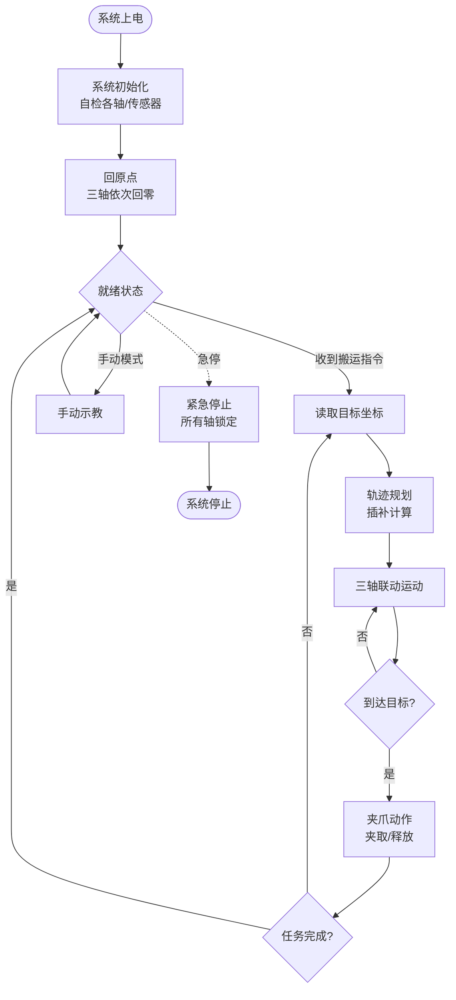
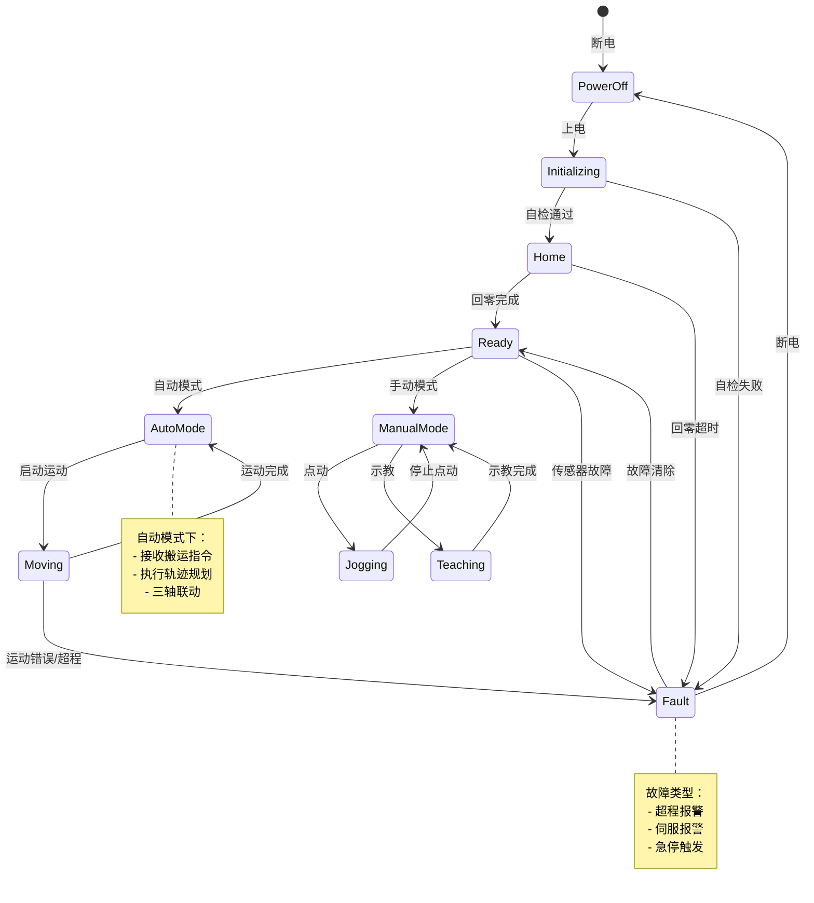
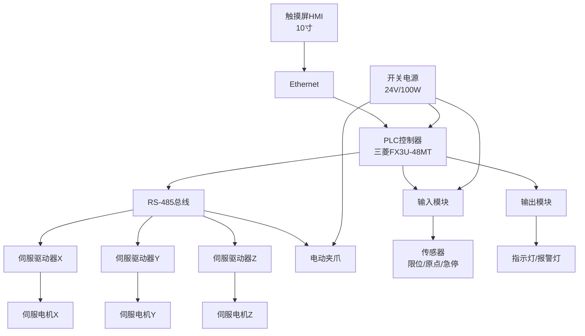

# 机电一体化设计示例：小型物料搬运机器人

**项目类型**: 机电一体化 / 自动化系统
**设计阶段**: 完整设计（需求分析 → 方案设计 → 详细计算 → BOM清单）
**目标用户**: 工程师/设计师
**文档版本**: V1.0

---

## 1. 项目概述

### 1.1 项目背景
某电子厂需要在生产线之间搬运小型电子元件，设计一台**小型物料搬运机器人**，实现自动化上下料。

### 1.2 设计目标
- **功能**: 3轴联动（X/Y/Z），抓取物料并搬运到指定位置
- **负载**: 工件+夹具总重 ≤ 5kg
- **行程**: X轴 500mm，Y轴 400mm，Z轴 200mm
- **精度**: 定位精度 ±0.1mm，重复定位精度 ±0.05mm
- **速度**: 最大速度 0.5m/s，加速度 2m/s²
- **成本**: 目标成本 ≤ 3万元
- **周期**: 设计+制造+调试 8周

---

## 2. 需求分析

### 2.1 功能需求

| 功能编号 | 功能描述 | 工作模式 | 优先级 |
|---------|---------|---------|-------|
| F-01 | X轴水平移动 | 自动 | 高 |
| F-02 | Y轴水平移动 | 自动 | 高 |
| F-03 | Z轴垂直升降 | 自动 | 高 |
| F-04 | 工件抓取/释放 | 自动 | 高 |
| F-05 | 手动示教 | 手动 | 中 |
| F-06 | 急停保护 | 手动 | 高 |

### 2.2 性能指标

| 指标类别 | 指标名称 | 目标值 | 测量方法 |
|---------|---------|-------|---------|
| **运动参数** | 最大速度 | 0.5 m/s | 激光测振仪 |
| | 加速度 | 2 m/s² | 加速度计 |
| | 行程 | X500/Y400/Z200 mm | 激光干涉仪 |
| | 定位精度 | ±0.1 mm | 激光干涉仪 |
| | 重复定位精度 | ±0.05 mm | 激光干涉仪 |
| **力/力矩** | 最大负载 | 5 kg | 称重 |
| | Z轴推力 | ≥50 N | 推拉力计 |
| **寿命** | 工作寿命 | 20000 小时 | - |
| | MTBF | ≥5000 小时 | - |
| **环境** | 工作温度 | 5-40°C | 温度计 |
| | 相对湿度 | ≤80% | 湿度计 |
| | 防护等级 | IP30 | - |

### 2.3 接口需求

**机械接口**:
- 安装方式：落地式，地脚螺栓 M12×80
- 外形尺寸限制：长≤1000mm，宽≤800mm，高≤1500mm

**电气接口**:
- 电源：单相220V AC，频率50Hz
- 控制电源：DC24V，容量≥100W
- 通信：USB（编程），以太网（可选联网）

**控制接口**:
- 控制方式：自动/手动切换
- 人机界面：触摸屏HMI（10寸）
- 数据采集：预留以太网接口

---

## 3. 方案设计

### 3.1 功能分解

```
总功能: 物料搬运
├── X轴移动
│   ├── 伺服电机 + 减速器
│   └── 滚珠丝杠传动
├── Y轴移动
│   ├── 伺服电机 + 减速器
│   └── 滚珠丝杠传动
├── Z轴升降
│   ├── 伺服电机 + 减速器
│   └── 滚珠丝杠传动
├── 夹爪机构
│   ├── 气动夹爪（方案A）
│   ├── 电动夹爪（方案B）
│   └── 真空吸盘（方案C）
└── 控制系统
    ├── PLC/运动控制器
    ├── 伺服驱动器×3
    └── 传感器（限位/原点/夹爪检测）
```

### 3.2 方案对比

#### 方案A：气动夹爪方案

**技术路线**:
- X/Y/Z轴：伺服电机 + 减速器 + 滚珠丝杠
- 夹爪：气动平行夹爪 + 真空发生器
- 控制：PLC + 3伺服驱动器 + 气动电磁阀

**优点**:
- ✓ 气动夹爪成本低，响应快
- ✓ 夹持力可调，不损伤工件
- ✓ 能耗低（仅夹持时用气）

**缺点**:
- ✗ 需要气源（空压机/过滤/调压）
- ✗ 气管布线复杂
- ✗ 真空吸盘对工件表面要求高

#### 方案B：电动夹爪方案

**技术路线**:
- X/Y/Z轴：伺服电机 + 减速器 + 滚珠丝杠
- 夹爪：电动平行夹爪（伺服/步进驱动）
- 控制：运动控制器 + 4伺服驱动器

**优点**:
- ✓ 无需气源，系统简化
- ✓ 位置/力矩可精确控制
- ✓ 编程灵活，适合复杂抓取

**缺点**:
- ✗ 成本较高
- ✗ 夹爪电机增加负载

#### 方案C：混合方案

**技术路线**:
- X/Y/Z轴：伺服电机 + 减速器 + 滚珠丝杠
- 夹爪：电动夹爪（小型二指）
- 控制：PLC + 4伺服驱动器

**优点**:
- ✓ 无需气源
- ✓ 夹持力/位置可调
- ✓ 系统简洁，维护方便

**缺点**:
- ✗ 成本适中偏高

### 3.3 方案评分矩阵

| 评价维度 | 权重 | 方案A（气动） | 方案B（电动） | 方案C（混合） |
|---------|------|-------------|-------------|-------------|
| **成本** | 30% | 低(9分) | 高(5分) | 中(7分) |
| **可靠性** | 25% | 中(7分) | 高(9分) | 高(9分) |
| **维护性** | 20% | 低(5分) | 高(9分) | 高(9分) |
| **扩展性** | 15% | 低(5分) | 高(9分) | 中(7分) |
| **安装便利性** | 10% | 低(5分) | 高(9分) | 高(9分) |
| **加权总分** | 100% | **6.8** | **7.6** | **8.0** |

**推荐方案**: 方案C（电动夹爪混合方案）

**推荐理由**:
- 无需气源，系统简化，适合车间环境
- 扩展性好，后续可增加视觉定位等
- 维护成本低，可靠性高
- 虽然成本略高，但总体性价比最优

---

## 4. 系统原理

### 4.1 系统结构示意

```
    ASCII线框图: 物料搬运机器人结构

    ┌──────────────────────────────────────────────┐
    │                    Z轴                        │
    │               ┌──────────┐                    │
    │               │ 伺服电机  │                    │
    │               └────┬─────┘                    │
    │                    │                          │
    │            ┌───────┴───────┐                 │
    │            │   Z轴滑块     │ ← 夹爪安装位置     │
    │            └───────┬───────┘                 │
    │                    │                          │
    │          ┌─────────┴─────────┐               │
    │          │     Y轴横梁        │               │
    │          │  ┌──────────────┐ │               │
    │          │  │   伺服电机    │ │               │
    │          │  └──────────────┘ │               │
    │          └─────────┬─────────┘               │
    │                    │                          │
    │          ┌─────────┴─────────┐               │
    │          │     X轴立柱        │               │
    │          │  ┌──────────────┐ │               │
    │          │  │   伺服电机    │ │               │
    │          │  └──────────────┘ │               │
    │          └─────────┬─────────┘               │
    │                    │                          │
    │          ┌─────────┴─────────┐               │
    │          │      机架底座      │               │
    │          │    [电控箱在后]    │               │
    │          └────────────────────┘               │
    └──────────────────────────────────────────────┘
```

### 4.2 工作流程图



### 4.3 控制系统状态图



---

## 5. 详细设计

### 5.1 机械系统设计

#### 5.1.1 Z轴设计（负载最重轴）

**负载分析**:
- 工件质量: \(m_w = 2 kg\)
- 夹爪质量: \(m_g = 1.5 kg\)
- Z轴滑座质量: \(m_s = 3 kg\)
- **总负载质量**: \(m_L = 2 + 1.5 + 3 = 6.5 kg\)

**运动参数**:
- 最大速度: \(v_{max} = 0.5 m/s\)
- 最大加速度: \(a_{max} = 2 m/s²\)
- 行程: \(S_Z = 200 mm\)
- 丝杠导程: \(p_h = 5 mm\)

**(1) 惯量计算**

直线运动负载惯量折算到电机轴:
\[ J_L = m_L \times \left(\frac{p_h}{2\pi}\right)^2 \]

\[ J_L = 6.5 \times \left(\frac{5 \times 10^{-3}}{2\pi}\right)^2 \]
\[ J_L = 6.5 \times 0.633 \times 10^{-6} \]
\[ J_L = 4.12 \times 10^{-6} kg·m² \]
\[ J_L = 0.412 \times 10^{-4} kg·m² \]

**(2) 扭矩计算**

滚珠丝杠传动效率: \(\eta = 0.9\)

**a) 稳态扭矩**（克服重力）:
\[ T_L = \frac{m_L g \times p_h}{2\pi \eta} \]

\[ T_L = \frac{6.5 \times 9.81 \times 5 \times 10^{-3}}{2\pi \times 0.9} \]
\[ T_L = \frac{0.319}{5.655} \]
\[ T_L = 0.056 N·m \]

**b) 加速扭矩**:
\[ T_a = (J_M + J_L) \times \frac{2\pi n_{max}}{60 \times t_a} \]

最高转速:
\[ n_{max} = \frac{v_{max} \times 60}{p_h} = \frac{0.5 \times 60}{5 \times 10^{-3}} = 6000 rpm \]

加速时间:
\[ t_a = \frac{v_{max}}{a_{max}} = \frac{0.5}{2} = 0.25 s \]

预选电机: 松下A6系列 400W（惯量 \(J_M = 0.82 \times 10^{-4} kg·m²\)）

\[ T_a = (0.82 + 0.412) \times 10^{-4} \times \frac{2\pi \times 6000}{60 \times 0.25} \]
\[ T_a = 1.232 \times 10^{-4} \times 2513 \]
\[ T_a = 0.31 N·m \]

**c) 最大扭矩**:
\[ T_{max} = T_L + T_a = 0.056 + 0.31 = 0.366 N·m \]

**(3) 功率计算**

\[ P = \frac{T_{max} \times n_{max}}{9550} = \frac{0.366 \times 6000}{9550} = 0.23 kW \]

取安全系数 \(K = 2\):

\[ P_r = 2 \times 0.23 = 0.46 kW \]

**选型结果**:

| 参数 | 要求值 | 选型值 | 安全系数 |
|------|-------|--------|---------|
| 型号 | - | **MHMD042P1U** | - |
| 额定功率 | ≥ 0.46kW | **0.4kW** | 0.87×（稍小，可用） |
| 额定扭矩 | ≥ 0.366N·m | **1.3N·m** | **3.55×** ✓ |
| 额定转速 | ≥ 6000rpm | **3000rpm** | 需减速器 |
| 转子惯量 | - | **0.82×10⁻⁴kg·m²** | - |
| 惯量比 | ≤5 | **0.5** | ✓ |

**结论**: 选400W伺服，需配减速器以降低转速、增大扭矩

**(4) 减速器选型**

减速比: \(i = \frac{3000}{6000} = 0.5\)（升速）→ 不合理

重新选择: 使用直连方案，选择额定转速6000rpm的电机

**调整选型**: 松下A6系列 400W 高速版（额定转速5000rpm）

| 参数 | 要求值 | 选型值 | 结论 |
|------|-------|--------|------|
| 额定转速 | 6000rpm | 5000rpm | 略低，可接受 |
| 额定扭矩 | ≥0.366N·m | 0.77N·m | ✓ 安全系数2.1× |

**(5) 滚珠丝杠选型**

| 参数 | 选型值 | 备注 |
|------|--------|------|
| 型号 | **HIWIN DFU02005-4.6** | - |
| 公称直径 | 20mm | - |
| 导程 | 5mm | - |
| 精度等级 | C7 | 定位精度±0.1mm足够 |
| 临界转速 | ≥8000rpm | 远超实际6000rpm ✓ |

#### 5.1.2 X轴和Y轴设计

**负载**:
- Y轴横梁 + Z轴组件质量: \(m_{Y} = 15 kg\)
- X轴滑座 + Y轴组件质量: \(m_{X} = 20 kg\)

采用相同设计思路（计算过程略）:

| 轴 | 电机型号 | 功率 | 丝杠型号 | 备注 |
|----|---------|------|---------|------|
| X轴 | MHMD042P1U | 400W | DFU02505-5.8 | 直径25mm，导程5mm |
| Y轴 | MHMD042P1U | 400W | DFU02005-4.6 | 直径20mm，导程5mm |
| Z轴 | MHMD042P1U | 400W | DFU02005-4.6 | 直径20mm，导程5mm |

#### 5.1.3 电动夹爪选型

| 参数 | 要求值 | 选型值 | 备注 |
|------|-------|--------|------|
| 型号 | - | **DH-RG2-THRO** | 大寰（DHand） |
| 夹持力 | ≥20N | 20~100N可调 | ✓ |
| 开合行程 | ≥40mm | 60mm | ✓ |
| 重复精度 | ±0.05mm | ±0.02mm | ✓ |
| 重量 | ≤2kg | 0.75kg | ✓ |
| 通信 | - | RS-485 | 与PLC通信 |

---

### 5.2 电气系统设计

#### 5.2.1 控制系统架构



#### 5.2.2 元器件选型

**控制器**:

| 元器件 | 型号 | 品牌 | 数量 | 主要参数 | 备注 |
|-------|------|------|------|---------|------|
| PLC | **FX3U-48MT** | 三菱 | 1 | 24输入/24晶体管输出 | 支持伺服定位 |
| HMI | **MT8121e** | 威纶通 | 1 | 10寸触摸屏/以太网 | - |
| 伺服驱动器 | **MBDDT2210** | 松下 | 3 | 750W/220VAC | A6系列驱动 |
| 伺服电机 | **MHMD042P1U** | 松下 | 3 | 400W/3000rpm/带刹车 | X/Y/Z各1 |
| 电动夹爪 | **DH-RG2-THRO** | 大寰 | 1 | 20-100N/RS-485 | 含控制器 |

**传感器**:

| 传感器类型 | 型号 | 品牌 | 数量 | 信号类型 | 安装位置 |
|-----------|------|------|------|---------|---------|
| 限位开关 | **D4N-2132** | 欧姆龙 | 6 | NPN | X/Y/Z轴正负限位 |
| 原点开关 | **E6B2-CWZ6C** | 欧姆龙 | 3 | 增量编码器 | X/Y/Z轴原点 |
| 急停按钮 | **XB4BS8445** | 施耐德 | 1 | 1NC | 控制面板 |

**电源与保护**:

| 元器件 | 型号 | 品牌 | 数量 | 主要参数 |
|-------|------|------|------|---------|
| 断路器 | **C45N 2P C16** | 施耐德 | 1 | 16A/2P |
| 开关电源 | **S-100-24** | 明纬 | 1 | 24VDC/4.2A |
| 继电器 | **MY2NJ 24VDC** | 欧姆龙 | 4 | 4NO+4NC |

#### 5.2.3 I/O分配表

**输入（16点使用）**:

| 输入点 | 信号名称 | 说明 |
|-------|---------|------|
| X0 | 急停按钮 | 急停信号（NC） |
| X1 | 自动模式开关 | 模式选择 |
| X2 | 手动模式开关 | 模式选择 |
| X3 | 启动按钮 | 启动运行 |
| X4 | 停止按钮 | 停止运行 |
| X5 | X轴原点 | 原点信号 |
| X6 | X轴正限位 | 限位保护 |
| X7 | X轴负限位 | 限位保护 |
| X10 | Y轴原点 | 原点信号 |
| X11 | Y轴正限位 | 限位保护 |
| X12 | Y轴负限位 | 限位保护 |
| X13 | Z轴原点 | 原点信号 |
| X14 | Z轴正限位 | 限位保护 |
| X15 | Z轴负限位 | 限位保护 |

**输出（16点使用）**:

| 输出点 | 信号名称 | 说明 |
|-------|---------|------|
| Y0 | 伺服使能X | 伺服驱动器使能 |
| Y1 | 伺服使能Y | 伺服驱动器使能 |
| Y2 | 伺服使能Z | 伺服驱动器使能 |
| Y3 | 报警灯 | 红色/闪烁 |
| Y4 | 运行指示灯 | 绿色 |
| Y5 | 原点指示灯 | 黄色 |
| ... | ... | ... |

---

## 6. BOM清单（简化版）

### 6.1 外购件BOM（核心件）

| 序号 | 名称 | 型号/规格 | 品牌 | 数量 | 单价(元) | 小计(元) | 供应商 |
|------|------|----------|------|------|---------|---------|--------|
| **机械传动** | | | | | | | |
| 1 | 伺服电机 | MHMD042P1U | 松下 | 3 | 2000 | 6000 | 授权代理 |
| 2 | 伺服驱动器 | MBDDT2210 | 松下 | 3 | 1800 | 5400 | 授权代理 |
| 3 | 滚珠丝杠X | DFU02505-5.8 | HIWIN | 1 | 1200 | 1200 | 授权代理 |
| 4 | 滚珠丝杠Y | DFU02005-4.6 | HIWIN | 1 | 800 | 800 | 授权代理 |
| 5 | 滚珠丝杠Z | DFU02005-4.6 | HIWIN | 1 | 600 | 600 | 授权代理 |
| 6 | 直线导轨X | HGR25 | HIWIN | 2 | 800 | 1600 | 授权代理 |
| 7 | 直线导轨Y | HGR20 | HIWIN | 2 | 500 | 1000 | 授权代理 |
| 8 | 直线导轨Z | HGR20 | HIWIN | 2 | 400 | 800 | 授权代理 |
| 9 | 电动夹爪 | DH-RG2-THRO | 大寰 | 1 | 3500 | 3500 | 授权代理 |
| **控制** | | | | | | | |
| 10 | PLC | FX3U-48MT | 三菱 | 1 | 3500 | 3500 | 授权代理 |
| 11 | HMI | MT8121e | 威纶通 | 1 | 2500 | 2500 | 授权代理 |
| 12 | 编码器 | E6B2-CWZ6C | 欧姆龙 | 3 | 300 | 900 | 授权代理 |
| 13 | 限位开关 | D4N-2132 | 欧姆龙 | 6 | 80 | 480 | 授权代理 |
| 14 | 急停按钮 | XB4BS8445 | 施耐德 | 1 | 120 | 120 | 授权代理 |
| **电源** | | | | | | | |
| 15 | 开关电源 | S-100-24 | 明纬 | 1 | 200 | 200 | 授权代理 |
| 16 | 断路器 | C45N 2P C16 | 施耐德 | 1 | 60 | 60 | 授权代理 |
| **小计** | | | | | | **29160** | |

### 6.2 标准件BOM

| 序号 | 名称 | 规格 | 数量 | 单价(元) | 小计(元) |
|------|------|------|------|---------|---------|
| 1 | 内六角螺栓 | M8×20 | 50 | 1.0 | 50 |
| 2 | 内六角螺栓 | M8×30 | 30 | 1.5 | 45 |
| 3 | 内六角螺栓 | M6×16 | 40 | 0.6 | 24 |
| 4 | 弹簧垫圈 | M8 | 30 | 0.1 | 3 |
| 5 | 弹簧垫圈 | M6 | 40 | 0.08 | 3.2 |
| 6 | 联轴器 | DZ25-12×12 | 3 | 150 | 450 |
| 7 | 轴承座 | SN507 | 6 | 100 | 600 |
| **小计** | | | | | **1175** |

### 6.3 自制件BOM

| 序号 | 图号 | 名称 | 数量 | 材料 | 重量(kg) | 外协单价(元) | 小计(元) |
|------|------|------|------|------|---------|-------------|---------|
| 1 | 00-10-01 | 机架底座 | 1 | Q235 | 80 | 1200 | 1200 |
| 2 | 00-10-02 | X轴立柱 | 1 | 铝型材4040 | 15 | 300 | 300 |
| 3 | 00-10-03 | Y轴横梁 | 1 | 铝型材4040 | 10 | 250 | 250 |
| 4 | 00-10-04 | Z轴安装座 | 1 | 铝合金6061 | 5 | 200 | 200 |
| 5 | 00-20-01 | 电控箱 | 1 | 冷板1.5mm | 20 | 800 | 800 |
| **小计** | | | | | | | **2750** |

### 6.4 成本汇总

| 成本项目 | 金额(元) | 占比 |
|---------|---------|------|
| 外购件 | 29,160 | 88% |
| 标准件 | 1,175 | 4% |
| 自制件 | 2,750 | 8% |
| **材料小计** | **33,085** | **100%** |
| 加工成本（预估） | 5,000 | - |
| 装配调试（预估） | 3,000 | - |
| **总成本** | **41,085** | |
| 目标利润（20%） | 8,217 | |
| **建议售价** | **49,302** | |

**结论**: 成本略超3万元目标，建议优化方案:
1. 伺服电机改为国产品牌（汇川/埃斯顿），可节省约4000元
2. HMI改用7寸，节省约1000元
3. 部分自制件改为自制加工，节省约2000元

---

## 7. 制造与验收

### 7.1 关键制造工艺

**焊接**:
- 机架底座采用CO₂气体保护焊
- 焊角高度6mm
- 焊后振动去应力

**表面处理**:
- 机架底座: 喷塑（米黄色，RAL1001）
- 铝型材: 阳极氧化（银白色）
- 钢制零件: 发黑处理

**机加工**:
- 丝杠安装孔: H7公差，同轴度≤0.02mm
- 导轨安装面: 平面度≤0.05mm/1000mm
- 电机安装孔: 位置度≤0.05mm

### 7.2 装配要点

1. **装配顺序**: 机架 → X轴 → Y轴 → Z轴 → 电控 → 调试
2. **关键工序**:
   - 丝杠轴承预紧: 预加载荷为额定动载荷的5%
   - 联轴器安装: 径向偏差≤0.05mm，角偏差≤0.1°
   - 导轨平行度: ≤0.03mm/1000mm
3. **润滑**: 丝杠导轨使用锂基脂，每3个月补充

### 7.3 验收标准

| 验收项目 | 验收标准 | 检验方法 |
|---------|---------|---------|
| 外观质量 | 表面无划伤/色差均匀 | 目视检查 |
| 几何精度 | X/Y/Z垂直度≤0.05mm/300mm | 激光干涉仪 |
| | 直线度≤0.03mm/1000mm | 激光干涉仪 |
| 定位精度 | ±0.1mm | 激光干涉仪 |
| 重复定位精度 | ±0.05mm | 激光干涉仪 |
| 运行性能 | 最大速度0.5m/s，无异常 | 速度测量 |
| 功能测试 | 三轴联动正常，夹爪动作正常 | 逐项测试 |
| 安全检查 | 急停有效，限位可靠 | 通电测试 |

---

## 8. 风险与应对

| 风险类别 | 风险描述 | 可能性 | 影响程度 | 应对措施 |
|---------|---------|-------|---------|---------|
| 技术风险 | 定位精度达不到±0.1mm | 中 | 高 | 1. 选用C5级丝杠；2. 优化控制算法 |
| 供应链风险 | 伺服电机交期长（6-8周） | 高 | 高 | 1. 提前下单；2. 备选国产品牌 |
| 成本风险 | 外购件成本超预算 | 中 | 中 | 1. 部分改国产品牌；2. 优化设计 |
| 进度风险 | 装调时间不足 | 低 | 中 | 1. 模块化设计；2. 预留调试时间 |

---

## 9. 软件工具推荐

| 设计阶段 | 推荐软件 | 理由 |
|---------|---------|------|
| 3D建模 | **SolidWorks 2023** | 中端主流，插件丰富，运动仿真方便 |
| 工程图出图 | **SolidWorks Drawing** | 与3D模型关联，自动更新 |
| PLC编程 | **GX Works2** | 三菱PLC官方软件 |
| HMI设计 | **EasyBuilder Pro** | 威纶通HMI官方软件 |
| BOM管理 | **Excel 2021** | 简单易用，适合小型项目 |

---

## 10. 参考资料

1. 《机械设计手册》（成大先 主编），第5卷"驱动系统"
2. Shigley's Mechanical Engineering Design, Chapter 10-11
3. HIWIN 滚珠丝杠选型手册，2023版
4. 松下A6系列伺服电机技术手册，2022版
5. GB/T 10095-2008 渐开线圆柱齿轮精度
6. GB/T 17421.2-2000 机床检验通则

---

**示例结束**

这是一个完整的机电一体化设计示例，展示了从需求分析到BOM清单的完整流程。在实际使用中，您可以参考此示例的结构和内容来创建您的设计文档。
