# Mermaid图表示例 - 机械设计

**适用场景**: 机械设计、机电一体化、自动化系统
**更新日期**: 2024年

---

## 1. 流程图 (Flowchart)

### 1.1 设计流程图

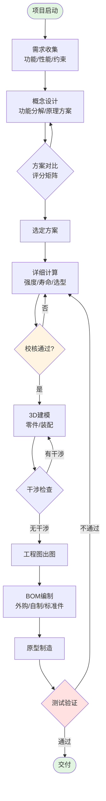

### 1.2 工作流程图

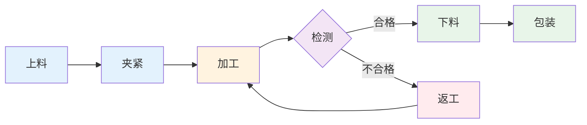

---

## 2. 状态图 (State Diagram)

### 2.1 系统状态机

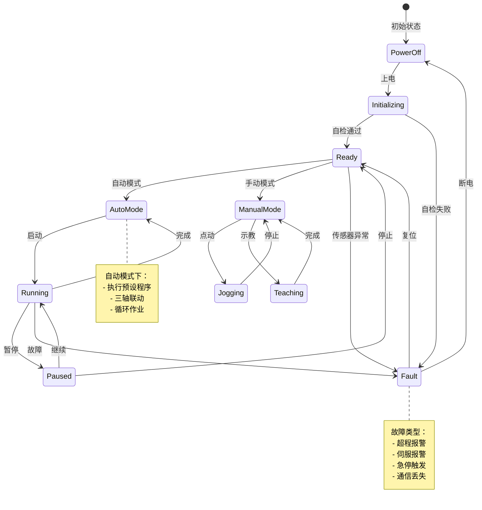

### 2.2 工作模式切换

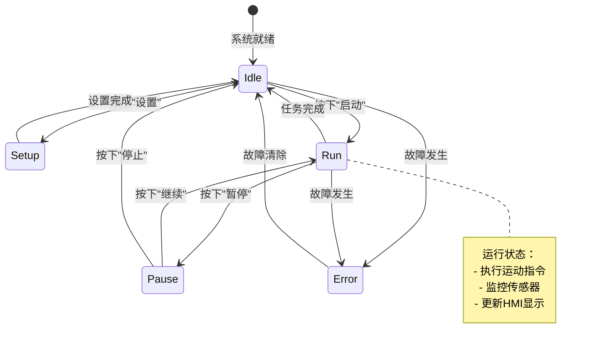

---

## 3. 时序图 (Sequence Diagram)

### 3.1 PLC与伺服通信时序

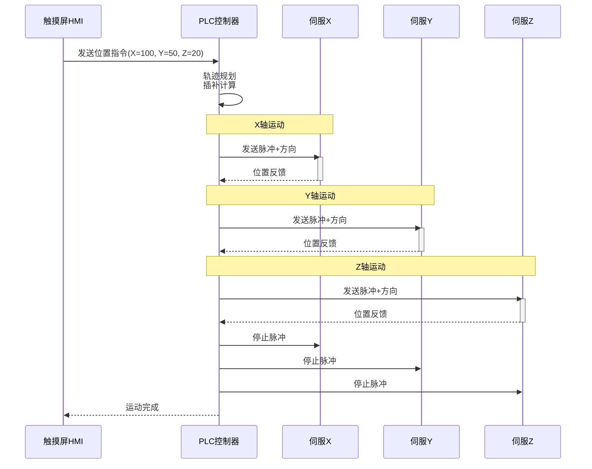

### 3.2 自动搬运流程时序

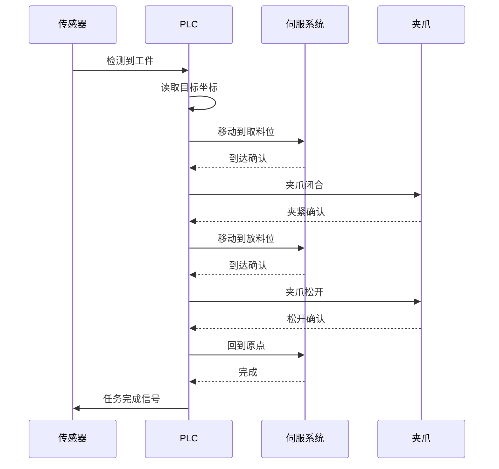

---

## 4. 类图 (Class Diagram) - 零件装配结构

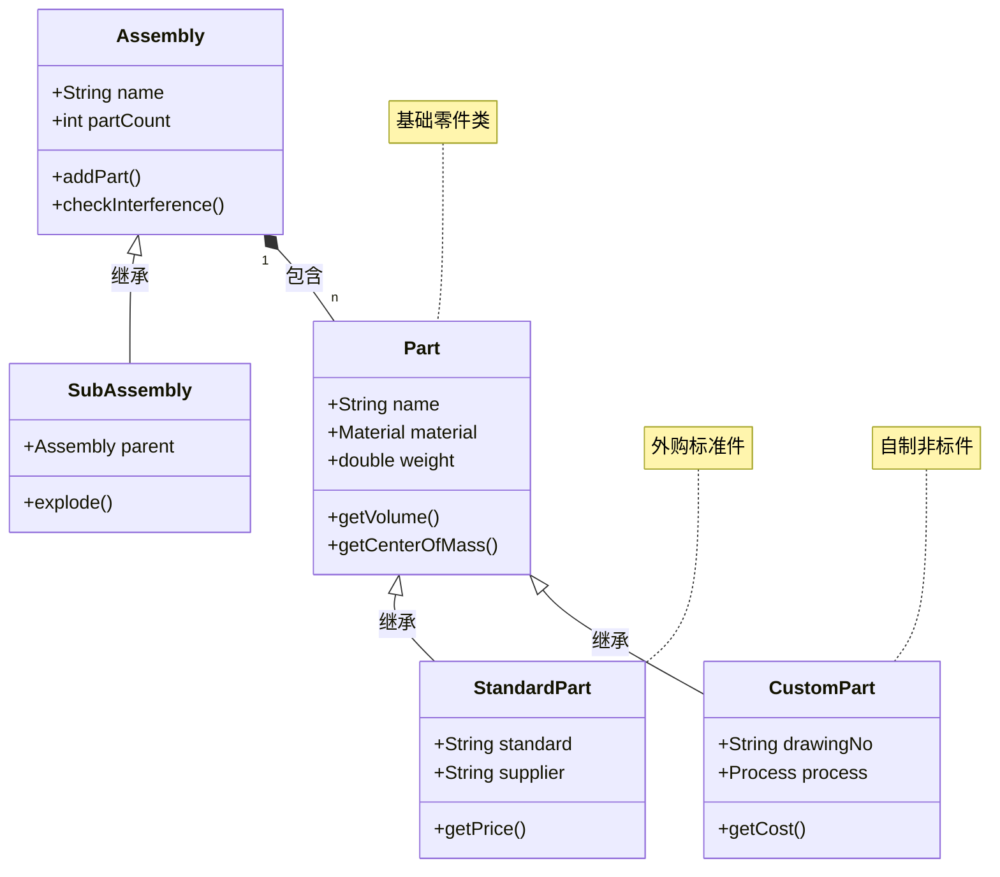

---

## 5. 实体关系图 (ER Diagram) - BOM数据结构

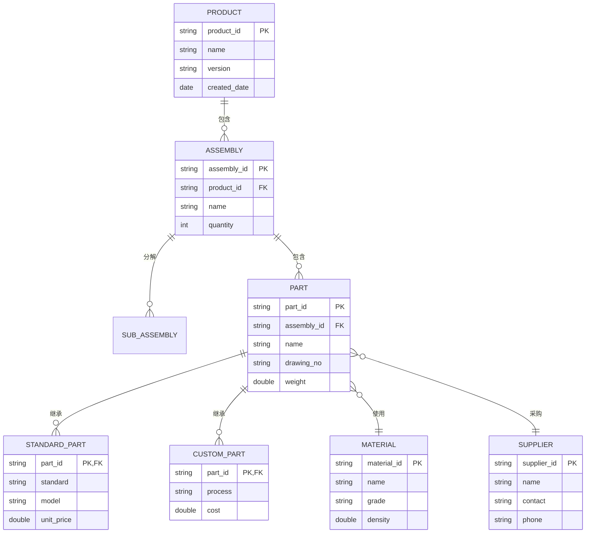

---

## 6. 甘特图 (Gantt Chart) - 项目进度

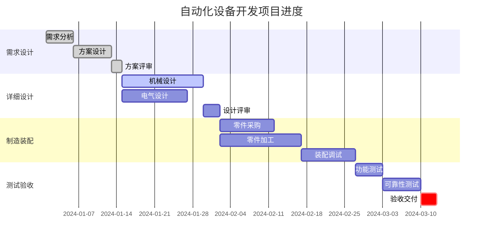

---

## 7. 饼图 (Pie Chart) - 成本分析

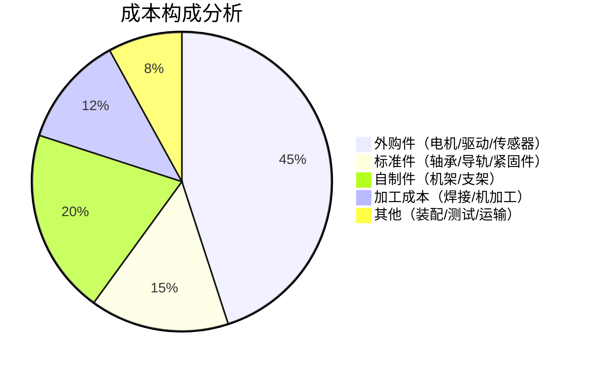

---

## 8. 旅程图 (Journey Map) - 用户使用流程

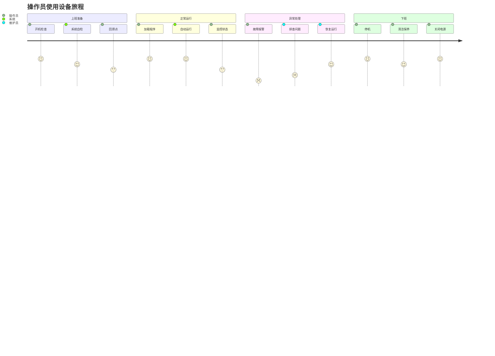

---

## 9. 网络图 (Graph) - 系统拓扑

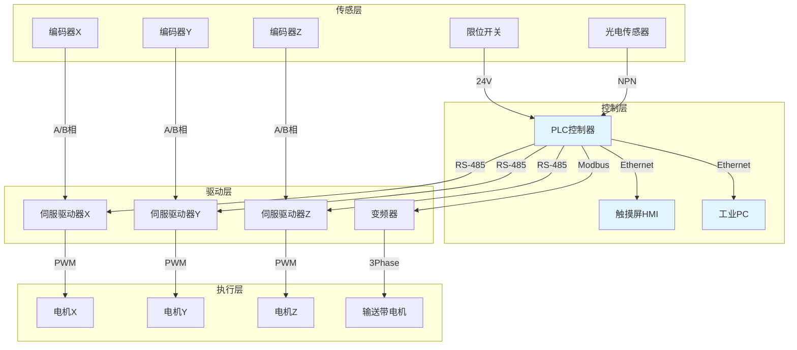

---

## 10. 思维导图 (Mindmap) - 知识体系

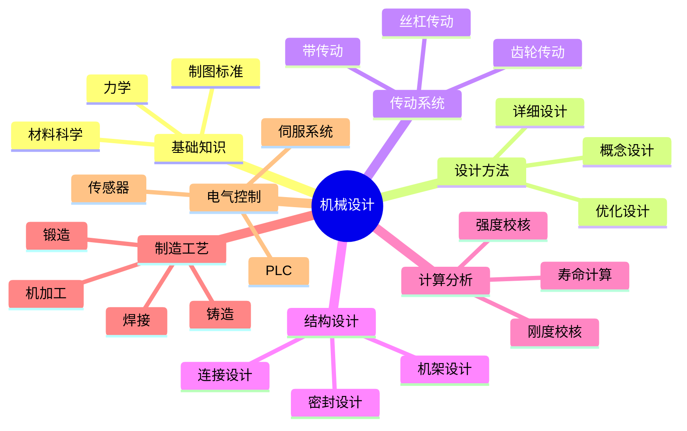

---

**使用建议**:

1. **流程图**: 用于表达设计流程、工作流程、工艺流程
2. **状态图**: 用于表达系统状态、工作模式、故障处理
3. **时序图**: 用于表达通信时序、控制逻辑、操作步骤
4. **类图**: 用于表达零件装配结构、数据结构
5. **ER图**: 用于表达BOM数据结构、数据库设计
6. **甘特图**: 用于表达项目进度、计划安排
7. **饼图**: 用于表达成本构成、时间分配
8. **旅程图**: 用于表达用户使用体验
9. **网络图**: 用于表达系统拓扑、电气连接
10. **思维导图**: 用于表达知识体系、设计思路

根据具体设计文档的需要，选择合适的图表类型来清晰表达信息。
